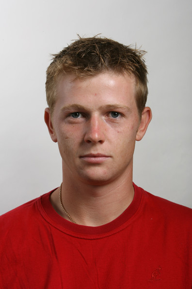
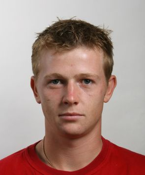
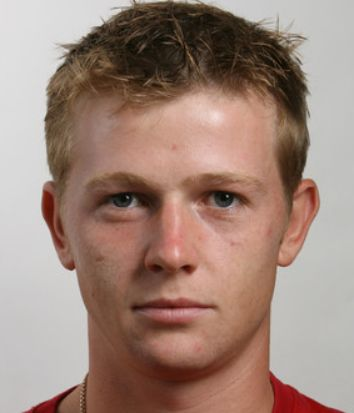
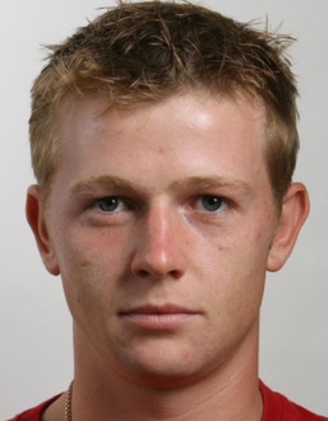

# FIPU face

Face detection using [RetinaFace](https://github.com/deepinsight/insightface/tree/master/RetinaFace) and image cropping to the desired format **@300dpi**.

FIPU face detects possible errors in the image:

- picture taken to close to the camera
- head tilted to the side
- not looking towards the camera
- covered eyes, nose or mouth
- multiple or no faces in the image
- image is too blurry

All errors (and appropriate messages) are stored in [ImageException.py](exceptions/image_exception.py)


If none of the errors are detected on the image, the face is cropped and resize'd to the desired format.

Supported formats:
- **x** (25x30)
- **30x35_11Plus**
- **30x35_11**
- **35x45_11Plus**
- **35x45_11**


#### The repo also provides Flask API which crops the image and returns the processed image as the response in either `base64` or `bytes` format.

##### Service supports uploading a file on the route `crop-face` with following options:

1. Uploading a file through a form (param name ***img***)
2. Uploading a file in base64 encoding using form/json (param name ***img64***)
3. Uploading a file encoded as bytes using form/json (param name ***img_bytes***)
4. Specifying output encoding using form/json (param name ***resp_enc***)
5. Specifying image format using form/json (param name **img_fmt**)

Response returns two types of json objects:

- When error occurs

```python
{"message": "Error description here"}
```

- When image processing completed successfully

```python
{"img": "/9/dsjdias...."} # Processed image in base64/bytes format
```


## Example


##### Original image




##### Croped and resized image

|           25x30@300dpi            | 30x35@300dpi                           | 35x45@300dpi                           |
| :-------------------------------: | -------------------------------------- | -------------------------------------- |
|  |  |  |


---


## Cropping your own image

Place your image in `imgs` folder and run `test.py` with the name of your image. New image would be placed under the same name in `imgs/new` folder.

```python
from fipu_face.fipu_face import *

def do_detect(stream_path):
    frame = cv2.imread('imgs/' + stream_path)
    try:
        frame = detect(frame)
        cv2.imwrite('imgs/new/' + stream_path, frame)
    except ImageException as e:
        print(e.message) # Error: standing to close, not looking straight etc.


if __name__ == '__main__':
    do_detect('test.jpg')

```


You can also check how your face is cropped in real time by running `camera_test.py`


## Future features

- [x] Image cropping for [official documents](https://mup.gov.hr/UserDocsImages/BannerZona/Upute%20za%20fotografije%202013%20(2).pdf) (in Croatia)
- [ ] Emotion detection - government document should have neutral emotion
- [ ] Check for face obstacles (eg. glasses, mask, hand in front of face) 


## References

- [RetinaFace](https://github.com/deepinsight/insightface/tree/master/RetinaFace) - Face detection
- [FER](https://pypi.org/project/fer/) - Facial expression recognition (in progress)
- [Real-time Glasses Detection](https://github.com/TianxingWu/realtime-glasses-detection) - Glasses detection (in progress)
- [Flask](https://flask.palletsprojects.com/en/1.1.x/) - API

