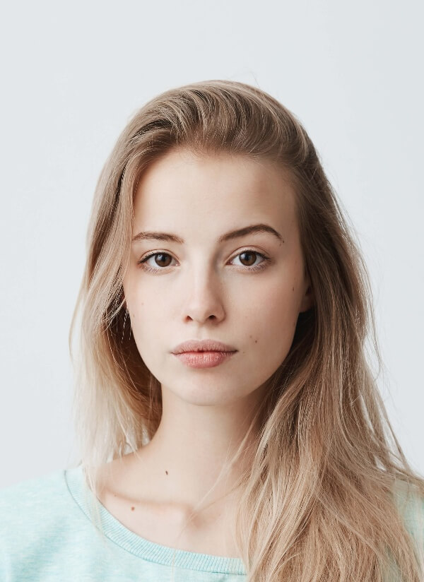
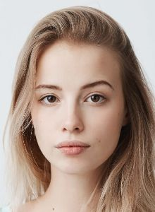
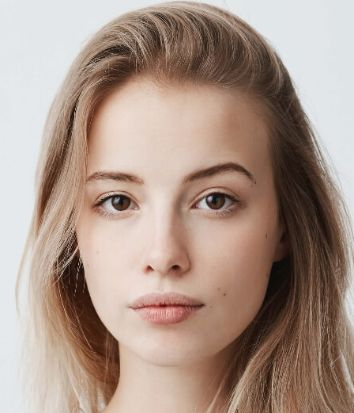
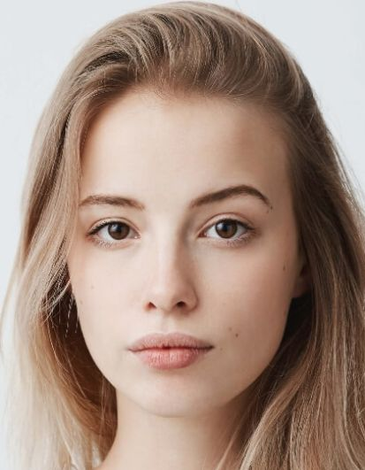

# FIPU face

Face detection using [RetinaFace](https://github.com/deepinsight/insightface/tree/master/RetinaFace) and image cropping to the desired format **@300dpi**.

FIPU face detects possible errors in the image:

- picture taken to close to the camera (`too_close`)
- head tilted to the side (`head_tilted`)
- head turned to the side (`head_turned`)
- no faces in the image (`no_face`)
- multiple faces in the image (`too_many_faces`)
- image is too blurry (`image_blurry`)
- image background is not white (`non_white_bg`)
- eyes, nose or mouth not detected (`no_landmarks`)


All errors (and appropriate messages) are stored in [ImageException.py](exceptions/image_exception.py)


If none of the errors are detected on the image, the face is cropped and resize'd to the desired format.

Supported formats:
- **x_220x300** (18.6x25.4)
- **x_300x300** (25.4x25.4)
- **30x35_11Plus**
- **30x35_11**
- **35x45_11Plus**
- **35x45_11**


#### The repo also provides Flask API which crops the image and returns the processed image as the response in either `base64` or `bytes` format.

##### Service supports uploading a file on the route `crop-face` with following options:

1. Uploading a file through a form (param name ***img***)
2. Uploading a file in base64 encoding using form/json (param name ***img64***)
3. Uploading a file encoded as bytes using form/json (param name ***img_bytes***)
4. Specifying output encoding using form/json (param name ***resp_enc***)
5. Specifying image format(s) using form/json (param name **img_sizes**) (string, list, dictionary)


Request example:
```python
{"img64": "/9/dsjdias...", # Original image in base64 format
 "img_sizes": {"img_big": "x_300x300", "img_small": "x_220x300"} # Or "x_220x300", or ["x_220x300", "x_300x300"]
}

```


Response returns two types of json objects:

- When error occurs

```python
{"img": "/9/dsjdias....", # Image with errors displayed in it
 "errors": [{'error_code': 'err1', 'message': 'Detail message error 1'},
            {'error_code': 'err2', 'message': 'Detail message error 2'}]}
```

- When image processing completed successfully

If only one format was asked

```python
{"img": "/9/dsjdias...."} # Processed image in base64/bytes format 
```

If multiple formats were asked (list, or tuple)

```python
{
 "img0": "/9/dsjdias....", # Processed image in base64/bytes format 
 "img1": "/9/dsjdias...." # Processed image in base64/bytes format
}
```


If multiple formats were asked (dictionary)

```python
{
 "img_big": "/9/dsjdias....", # Processed image in base64/bytes format using the key form the request 
 "img_small": "/9/dsjdias...."# Processed image in base64/bytes format using the key form the request
}
```


## Example


##### Original image




##### Cropped and resize'd image

|           x                       | 30x35@300dpi                           | 35x45@300dpi                           |
| :-------------------------------: | -------------------------------------- | -------------------------------------- |
|  |  |  |


---


## Cropping your own image

### Setup

#### Install required packages

````bash
pip install -r requirements.txt
````

Place your image in `imgs` folder and run `test.py`. New image would be placed under the same name in `imgs/new` folder. If the validation fails the image, with the errors on the image, will be placed in `imgs/draw`.
The error codes of the exceptions will also bi printed in the console.

## Environment

Create a `.env` file with following content (adjustment needed):
```bash
FLASK_ENV=development
BUGSNAG_API_KEY=
```


##### `Test.py code`

```python
from fipu_face.fipu_face import *
import os


def do_detect(stream_path):
    print(stream_path)
    frame = cv2.imread('imgs/' + stream_path)
    try:
        frame = detect(frame)
        cv2.imwrite('imgs/new/' + stream_path.replace('.jpg', '.jpg'), frame, [cv2.IMWRITE_JPEG_QUALITY, JPEG_QUALITY])
    except ImageException as e:
        cv2.imwrite('imgs/draw/' + stream_path, e.image, [cv2.IMWRITE_JPEG_QUALITY, JPEG_QUALITY])
        print(e.get_error_codes())


if __name__ == '__main__':
    for i in sorted([f for f in os.listdir('imgs/') if f.split('.')[-1] in ['jpg', 'jpeg', 'png'] ]):
        do_detect(i)
```


You can also check how your face is cropped, and what errors are displayed, in real time by running `tests/camera_test.py`


## Future features

- [x] Image cropping for [official documents](https://mup.gov.hr/UserDocsImages/BannerZona/Upute%20za%20fotografije%202013%20(2).pdf) (in Croatia)
- [ ] Emotion detection - government document should have neutral emotion
- [ ] Check for face obstacles (eg. glasses, mask, hand in front of face) 


## References

- [RetinaFace](https://github.com/deepinsight/insightface/tree/master/RetinaFace) - Face detection
- [FER](https://pypi.org/project/fer/) - Facial expression recognition (in progress)
- [Real-time Glasses Detection](https://github.com/TianxingWu/realtime-glasses-detection) - Glasses detection (in progress)
- [Flask](https://flask.palletsprojects.com/en/1.1.x/) - API

